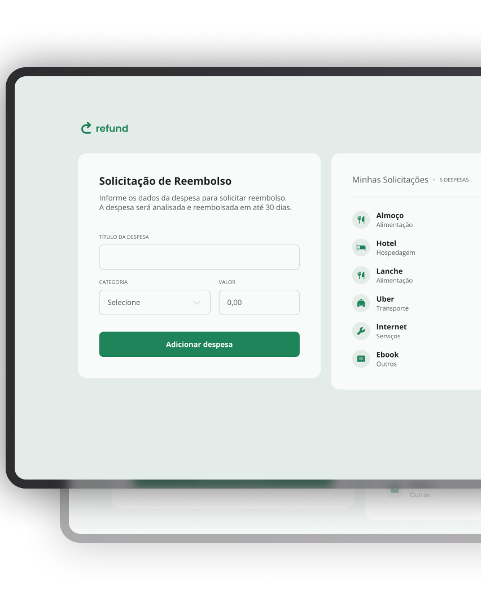

<h1 align="center">Refund</h1>

  

## 📖 Sobre

O **Refund** é uma aplicação web para registro e gerenciamento de solicitações de reembolso.

Através da aplicação, o usuário pode adicionar uma despesa informando seu nome, categoria e valor. Cada despesa é adicionada dinamicamente à lista, exibindo sua categoria, valor e um ícone correspondente.

A aplicação também calcula automaticamente a quantidade de despesas cadastradas e o valor total das solicitações, além de permitir a remoção individual dos itens.

## 🚀 Funcionalidades
- Adicionar novas despesas
- Informar o nome da despesa
- Selecionar uma categoria
- Categorias disponíveis:
- Alimentação
- Hospedagem
- Serviços
- Transporte
- Outros
- Formatação automática de valores em Real Brasileiro (BRL)
- Criação dinâmica dos itens da lista
- Exibição de ícones de acordo com a categoria selecionada
- Contagem automática da quantidade de despesas
- Cálculo automático do valor total
- Remoção de despesas da lista
- Atualização automática dos totais após uma remoção
- Limpeza automática do formulário após adicionar uma despesa
- Validação de campos obrigatórios
- Layout responsivo para diferentes tamanhos de tela

## 🛠️ Tecnologias

Este projeto foi desenvolvido utilizando:

- HTML5
- CSS3
- JavaScript
- Google Fonts — Open Sans

## 🧠 Conceitos praticados

Durante o desenvolvimento do projeto foram trabalhados conceitos importantes de JavaScript, como:

- Seleção de elementos do DOM
- Manipulação do DOM
- Eventos de input
- Eventos de submit
- Eventos de click
- preventDefault()
- Criação dinâmica de elementos HTML
- Manipulação de classes
- Manipulação de atributos
- Objetos
- Funções
- Arrow Functions
- Estruturas de repetição
- Operador ternário
- Expressões regulares (Regex)
- Conversão e tratamento de valores
- parseFloat()
- isNaN()
- toLocaleString()
- try...catch
- Template Strings
- Event Delegation
- Manipulação e remoção de elementos da página

## 💰 Formatação de valores

Os valores informados pelo usuário são tratados automaticamente pelo JavaScript e convertidos para o padrão monetário brasileiro.

Exemplo:

1500 → R$ 15,00

Para isso, a aplicação utiliza o método:

toLocaleString("pt-BR")

garantindo a exibição dos valores no formato BRL.

## 📊 Atualização das despesas

Sempre que uma nova despesa é adicionada, a aplicação atualiza automaticamente:

A quantidade de despesas cadastradas
O valor total das solicitações

Quando uma despesa é removida, os valores também são recalculados dinamicamente.

## 📱 Responsividade

O projeto possui adaptação para diferentes tamanhos de tela.

Em telas maiores, o formulário e a lista de despesas são apresentados lado a lado.

Em dispositivos menores, o layout passa a utilizar uma estrutura vertical, facilitando a utilização da aplicação em tablets e smartphones.

Foram utilizadas Media Queries para realizar essas adaptações.

## 📁 Estrutura do projeto
- `index.html` — estrutura principal da aplicação
- `styles.css` — estilos, layout, responsividade e interações visuais
- `scripts.js` — lógica das despesas, cálculos e manipulação do DOM
- `img/` — recursos visuais utilizados no projeto
    - `logo.svg` — logotipo da aplicação
    - `chevron-down.svg` — ícone utilizado no seletor de categorias
    - `remove.svg` — ícone utilizado para remover uma despesa
    - `food.svg` — ícone da categoria Alimentação
    - `accommodation.svg` — ícone da categoria Hospedagem
    - `services.svg` — ícone da categoria Serviços
    - `transport.svg` — ícone da categoria Transporte
    - `others.svg` — ícone da categoria Outros
    - `preview.png` — prévia do projeto

## ▶️ Como executar
Clone este repositório:
git clone URL-DO-REPOSITORIO
Acesse a pasta do projeto:
cd refund
Abra o arquivo index.html no navegador.

Também é possível utilizar a extensão Live Server no VS Code para executar o projeto localmente.

🎯 Objetivo do projeto

O principal objetivo deste projeto foi praticar a utilização do JavaScript para manipulação do DOM, criando uma aplicação capaz de receber informações do usuário e atualizar a interface dinamicamente.

Além da manipulação dos elementos HTML, o projeto permitiu praticar tratamento de valores monetários, eventos, objetos, funções, criação e remoção dinâmica de elementos e atualização de dados exibidos na página.